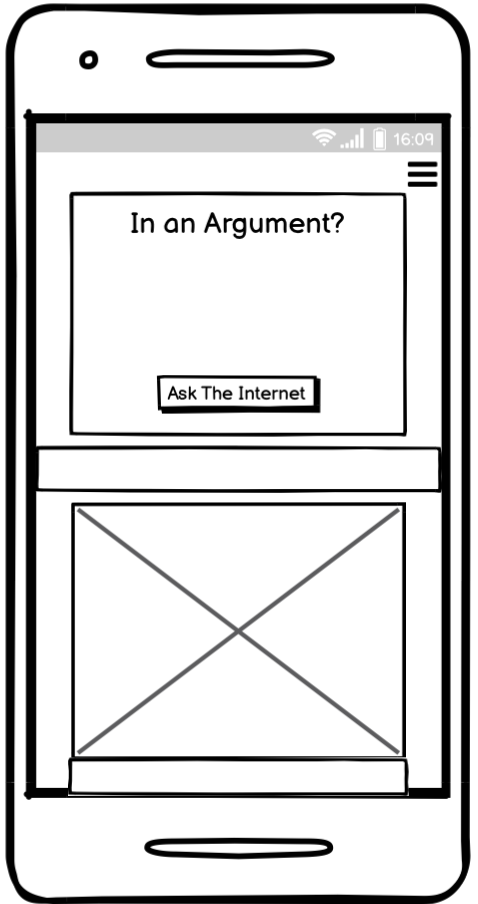
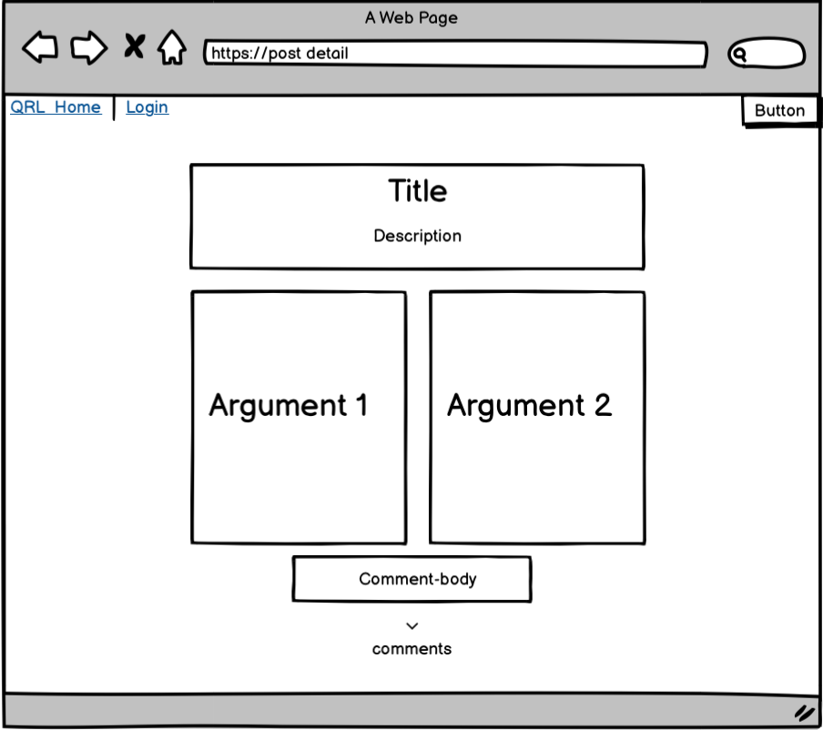

# relationship-quarrel

Live link:

## About:

Quarrel is a platform where arguments are come to an end. Two people face off in an attempt to solve their argument once and for all. Do you have a spouse who you claim never to do the dishes and when you bring it up they claim that you're the one never doing the dishes? Usually on the internet we just hear one-sided stories "my spouse/friend never does this and always does this, bla bla" - with Quarrel you get both sides of the story. Other users are able to like, to choose who's right, as well as offer advice/comment.

### Table of Contents

1. [Goals](#goals)
   1. [Organisational Goals](#organisation-goals)
   2. [User Stories](#user-stories)
2. [Design](#design)
   1. [Box Shadow](#box-shadow)
   2. [Color palette day](#color-palette-day)
   3. [Color palette night](#color-palette-night)
3. [Planning](#planning)
   1. [Fonts](#fonts)
4. [Testing](#testing)
   1. [Lighthouse](#lighthouse)
   2. [Validator](#validator-testing)
5. [Credits](#credits)

## Goals

### Organisation Goals

### User Stories

1. As a Site user I can view posts so that I can choose which i'd like to open

2. As a Site user I can Click on a post so that read the full post

3. As a Site User / Admin I can view comments on a post so that i can read the comments

4. As a Site user / Admin I can view the number of likes on each post so that I can see which argument is winning

5. As a Site User I can create an account so that I can comment, like, and post

6.As a Site User I can create a post so that I can view it on the site and receive comments from other users

7.As a Site user I can leave comments on a post so that I can be a part of the conversation

8.As a Site User I can create, read, update and delete posts so that I can manage my posts content

9.As a Site user I can go to next page so that I see more posts

10.As a User I can like which of the two posts i agree with so that I can be a part of deciding the winner of the argument

11.As a User I can update my post so that I can edit a post if something went wrong

12.As a user I can delete my post so that I, or anyone else, can see it anymore

13.As a user I can delete my account so that I don't have an account anymore

14.As a user I can have my own posts in a profile so that I can easily reach them

15.As a User I can delete my comment so that I can write a new one, or if I regret it

## Strategy

## Design

### Planning

I wireframed it using Balsamiq:

The only thing that strayed from the initial wireframe was the addition of the two themes.

### Fonts

font-family: "Roboto", sans-serif (The rest)
font-family: "Alfa Slab One" (H1/H2)

## Testing

I tested the responsiveness of the site on the below units, using chrome dev as well as some in real life testing:

**Mobile**

- Moto G4 (360x640)
- Galaxy S5 (360x640)
- Pixel 2 (411x731)
- Pixel 2 XL (411x823)
- iPhone 5/SE (320x568)
- iPhone 6/7/8 (375x667)
- iPhone 6/7/8 Plus (414x736)
- iPhone X (375x812)
- iPad (768x1024)
- iPad Pro (1024x1366)

**Browsers:**

- Chrome
- Mozilla Firefox
- Safari
- Edge

### Functional testing

See further on click [here](assets/testing.md)

### Lighthouse

### Validator Testing

W3 HTML Validator:

W3 CSS Validator:

JS validator:

The issues portrayed I deemed not needing a fix, considering the "defined but never used" is functions being called in the html-document.

## Unfixed Bugs

No known bugs.

## Improvements

## Features Left to Implement

## Deployment

- The site was deployed to GitHub pages. The steps to deploy are as follows:
  - In the GitHub repository, navigate to the Settings tab
  - From the source section drop-down menu, select the Master Branch
  - Once the master branch has been selected, the page will be automatically refreshed with a detailed ribbon display to indicate the successful deployment.

The live link can be found here - https://marcroth0.github.io/memory-game/

## Credits

- A general shout-out to [StackOverflow](https://stackoverflow.com/)

## Media
