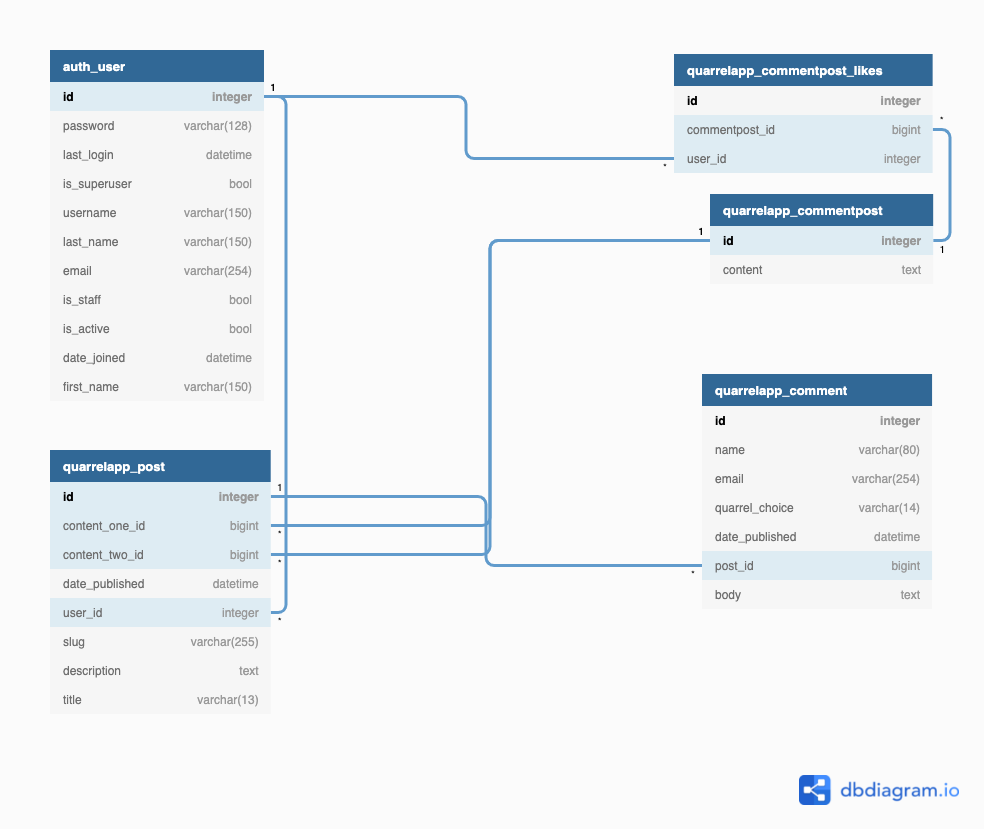
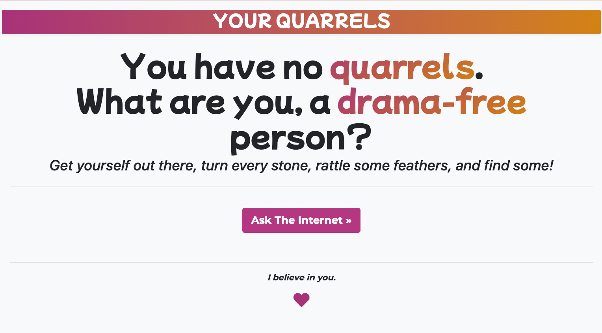
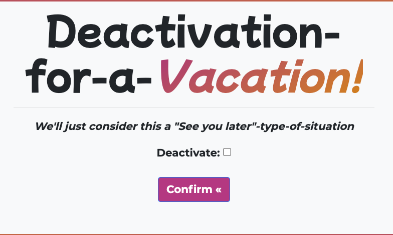
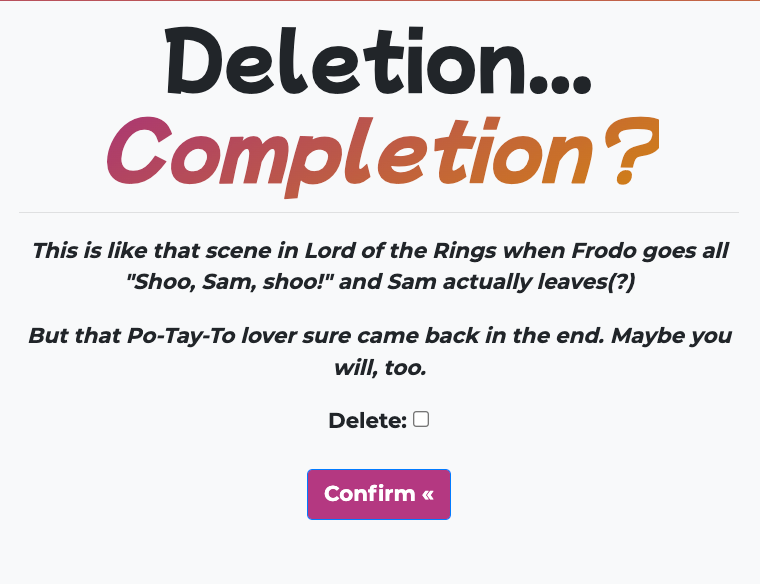
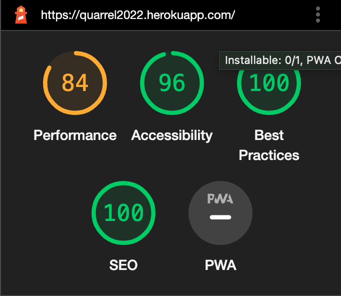
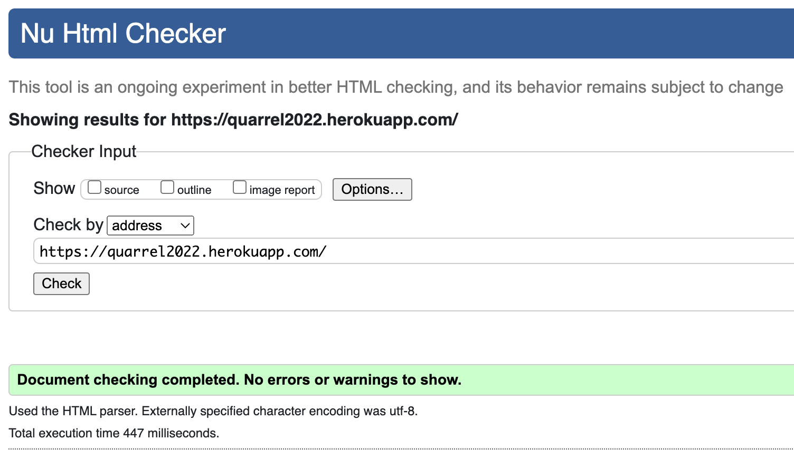
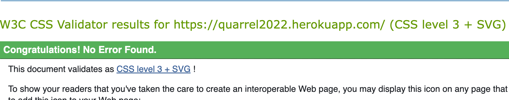

# relationship-quarrel

Live link: https://quarrel2022.herokuapp.com/

## About:

Quarrel is a platform where arguments are come to an end. Two people face off in an attempt to solve their argument once and for all. Do you have a spouse who you claim never to do the dishes and when you bring it up they claim that you're the one never doing the dishes? Usually on the internet we just hear one-sided stories "my spouse/friend never does this and always does this, bla bla" - with Quarrel you get both sides of the story. Other users are able to like, to choose who's right, as well as offer advice/comment.

### Table of Contents

1. [User Stories](#user-stories)
2. [UX](#ux)
   1. [Strategy](#strategy)
   2. [Design/Structure](#design/structure)
   3. [Databases](#databases)
   4. [Planning](#planning)
   5. [End Design](#end-design-result)
3. [Testing](#testing)
   1. [Manual Testing](#manual-testing)
   2. [Validator](#validator-testing)
   3. [Bugs](#unfixed-bugs)
   4. [Improvements](#improvements)
4. [Credits](#credits)

### User Stories

1. As a Site user I can view posts so that I can choose which i'd like to open

2. As a Site user I can Click on a post so that read the full post

3. As a Site User / Admin I can view comments on a post so that i can read the comments

4. As a Site user / Admin I can view the number of likes on each post so that I can see which argument is winning

5. As a Site User I can create an account so that I can comment, like, and post

6. As a Site User I can create a post so that I can view it on the site and receive comments from other users

7. As a Site user I can leave comments on a post so that I can be a part of the conversation

8. As a Site User I can create, read, update and delete posts so that I can manage my posts content

9. As a Site user I can go to next page so that I see more posts

10. As a User I can like which of the two posts i agree with so that I can be a part of deciding the winner of the argument

11. As a User I can update my post so that I can edit a post if something went wrong

12. As a user I can delete my post so that I, or anyone else, can see it anymore

13. As a user I can delete my account so that I don't have an account anymore

14. As a user I can have my own posts in a profile so that I can easily reach them

15. As a User I can delete my comment so that I can write a new one, or if I regret it

View my User Stories and planning [here](https://github.com/Marcroth0/relationship-quarrel/issues).

# UX

## Strategy

Target Audience:

- 18-40 year olds
- People who are looking to take arguments with a bit of comedy
- People who would like to improve their communication skills
- People who've seen too many one-sided-stories

The audience is looking for something where both sides are visible. With the ability to post both arguments and hash it out once and for all, with complete strangers on the internet, the site allows the user to read different points of views and thereafter see whose argument was the best.

## Design/Structure

Quarrel has been designed to be easily navigated, easily managed, and with few but important functions. Straight-forward argument-solving website. Through two apps and three models it acchieves its goal.

Apps:

1. Quarrelapp:
   Core functionality containing models(Post, Comments, CommentPost)
2. Websitemanage:
   Holds basic views-functions such as delete user, deactivate user, delete post, general views.

### Databases:

Quarrelapp holds all the databases, consisting of:

1. Post in combination with CommentPost allows for the ability of letting the user create a post, but through a OneToOneField with CommentPost, separate the likes and comments. Through the ability of calling different keys, connected to each argument, it allows for the possibility of cross-liking as well as future customization of the comment section(more on that in improvements) With each post, the model generates the users post but splits the content one and content two into separate keys which are then callable in views.
2. Comment allows for users to comment on posts with date-stamps, as well as Post, have a built-in CASCADE in order to delete all comments related to user if user decided to delete their account.

Below is a diagram of the correlation between the models:

### Planning

I wireframed it using Balsamiq:

Landing page:

Landing page - Mobile:

A post full screen:

### End Design Result:

Easily navigated navbar containing a home button, disguised as a logo, an about-page, a registration and a login-button that catches the visitors eye.

Navbar:

For users that are logged in, the post-button swaps to an account button, containing: My posts, deactivate account, delete account, as well as logout. The register button is replaced with an additional post-button.

Navbar(Logged in):

Landing page is a cooperation between the hero-image and the Quarrels-section. Instantly the visitor gets questions answered:

1. What the point of the site is
2. The possibility of being a part of it
3. How the posts are portrayed on the landing page

These three points together form a need to be included.

Hero:

Each title/category is tied too a specific image which automatically gets set when the user creates and posts their argument. Images are chosen to fit the theme of "whimsical"

Quarrels:

A clear visual separation between the two arguments, clearly with two separate colors from the same color-palette, in addition to the reference of "Fighter in left..." and "Fighter in right..."; both with each associated like-button.

Post Detail:

Following the whimsical theme, the about page displays a backstory of the creation of the website where the reader follows a somewhat typical situation every couple, or roommates, are able to relate to. Story is written as such in order to further comically portray arguments.

About page:

Simple, with an easter egg of the book-icon leading the user to webster-dictionary showing the definition of an argument.

Footer:

Whimsical writings:

### Color Palette

Colors:

### Reasoning

The design of the website was crucial. It being a "argument-solver" it needed to be peculiar and not take the initial argument, or the definition of an argument, all that seriously. With the ability of seeing it, instead of an obstacle, as a "funny challenge" to post it to the internet. Hence the sarcastic comments spread around the website. With a comical twist, on serious subjects, it will hopefully invoke a funny tone in the comments as well as an appearance of the "good side" of the internet which are there to actually help, inbetween a sea of funny anti-comments. (Comments mainly meant to ridicule)

### Fonts

Font-family: "Mochiy Pop P One", Montserrat;

##

## CRUD

- The user has the ability to
  C - reate their own post.
  R - read their, or others posts and comments.
  U - update their post
  D - delete their post and comments, as well as their account.

## Testing

I tested the responsiveness of the site on the below units, using chrome dev as well as some in real life testing:

**Mobile**

- Moto G4 (360x640)
- Galaxy S5 (360x640)
- Pixel 2 (411x731)
- Pixel 2 XL (411x823)
- iPhone 5/SE (320x568)
- iPhone 6/7/8 (375x667)
- iPhone 6/7/8 Plus (414x736)
- iPhone X (375x812)
- iPad (768x1024)
- iPad Pro (1024x1366)

**Browsers:**

- Chrome
- Mozilla Firefox
- Safari

### Manual testing

See further on click [here](readme-testing.md)

### Lighthouse

### Validator Testing

W3 HTML Validator:

W3 CSS Validator:

For Python I've used pep8 validator which resulted in 0 errors on all pages.

## Unfixed Bugs

1. There's a bug where if you type one very, very long word, without spaces, in argument one or two, the post_details overflows.

## Technologies used:

- I used [Python](https://www.python.org/) to write my functions and models

- [Django](https://www.djangoproject.com/) is the framework used to build project and its apps

- [Cloudinary](https://cloudinary.com/) has been used to store my images and static files

- [Crispyforms](https://django-crispy-forms.readthedocs.io/en/latest/) has been used to easily display forms

- [Github](https://github.com/) Has been to store and plan project

- [Vscode](https://code.visualstudio.com/) my choice of IDE

- [PostgreSQL](https://www.postgresql.org/) Database

- [SQlite](https://www.sqlite.org/index.html) has been used for local testing

- [Pep8](https://pypi.org/project/autopep8/) has been used for formatting and error-checking python-code

- [Prettier](https://marketplace.visualstudio.com/items?itemName=esbenp.prettier-vscode) has been used for formatting and error-checking html-code

- [ImgBot](https://imgbot.net/) - my trustworthy companion for optimizing size of images

- [Google-Developer-Tools](https://developers.google.com/web/tools) - for debugging

- [Bootstrap4](https://getbootstrap.com/) - css library

- [AmIResponsive](http://ami.responsivedesign.is/#) - used to check responsiveness, and collect image you find at the top of page.

## Features Left to Implement

- A reply-to-comments-function.
- The ability for one person to write their argument, then through a link allow the second one write theirs, when received the post get created and published.
- Pagination on post_detail for a smoother site experience and a feeling of "just one more"
- More categories
- The ability to sort by "Most popular", "Category"
- Add a "Quarrel of the week"
- Comments:
  Users should be able to ask for more information from either of the argumenters.
  Depending on which argument you've liked, your comment-background should have that color.
- User should be able to set a timer when the argument is deemed finished. (A day, two, a week)
- Choose a "fighter"-avatar.

## Deployment

The site was deployed using Heroku, following the steps offered by Codeinstitute. Instructions are found [here](https://codeinstitute.s3.amazonaws.com/fst/Django%20Blog%20Cheat%20Sheet%20v1.pdf)

Heroku:

1. Create an account with Heroku
2. Create a new app whilst logged in
3. Add Buildpacks 'Python' and 'NodeJS'
4. Connect your GitHub repository via "Connect to GitHub"
5. Set up your config vars (info in doc above)
6. Enable either "Automatic Deploys" or do it manually.

Using Cloudinary and how to set it up can be read here, as well as in the above document.
[here](https://devcenter.heroku.com/articles/cloudinary)

## Credits

- A general shout-out to [StackOverflow](https://stackoverflow.com/), which solved a lot of issues.
- Credit for images used in posts [chikenbugagashenka](https://www.freepik.com/free-vector/boys-girls-kids-aggression-conflict-set_20892288.htm#query=argue&position=11&from_view=search)
- [dbdiagram](https://dbdiagram.io/) for offering a database-visualiser
