## Manual Testing

Automated testing resulted in 51% coverage. In order to fully test the websites functionality the remaining will be done in manual testing. Following the User Stories listed below.

- 1 As a Site user I can view posts so that I can choose which i'd like to open

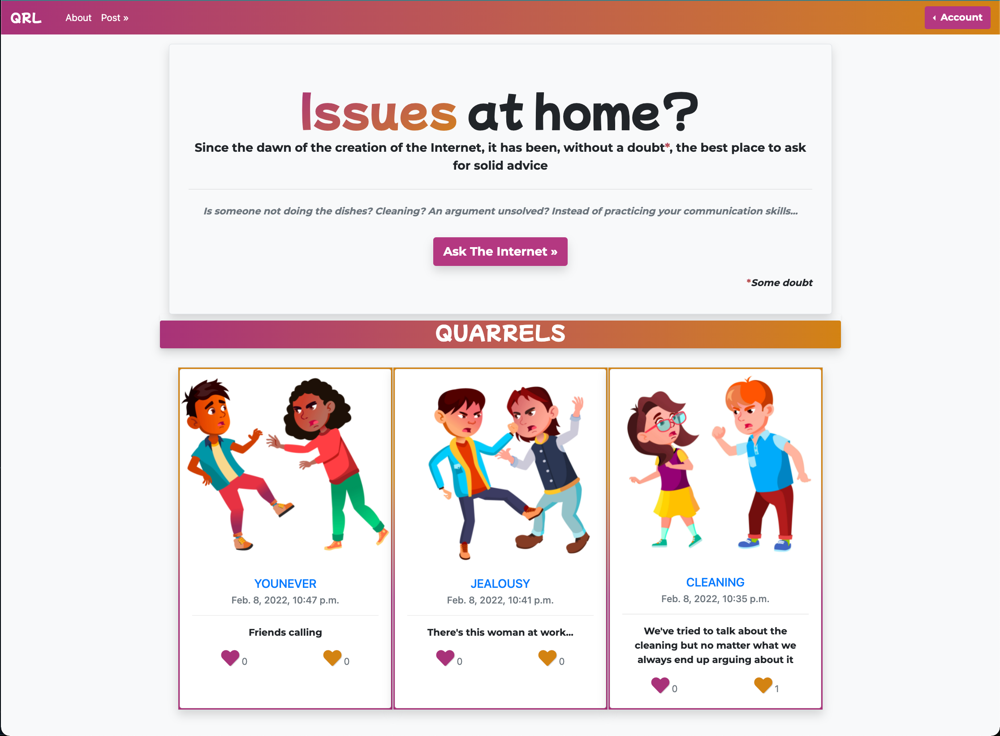

- 2 As a Site user I can Click on a post so that read the full post, -3 As a Site User / Admin I can view comments on a post so that i can read the comments

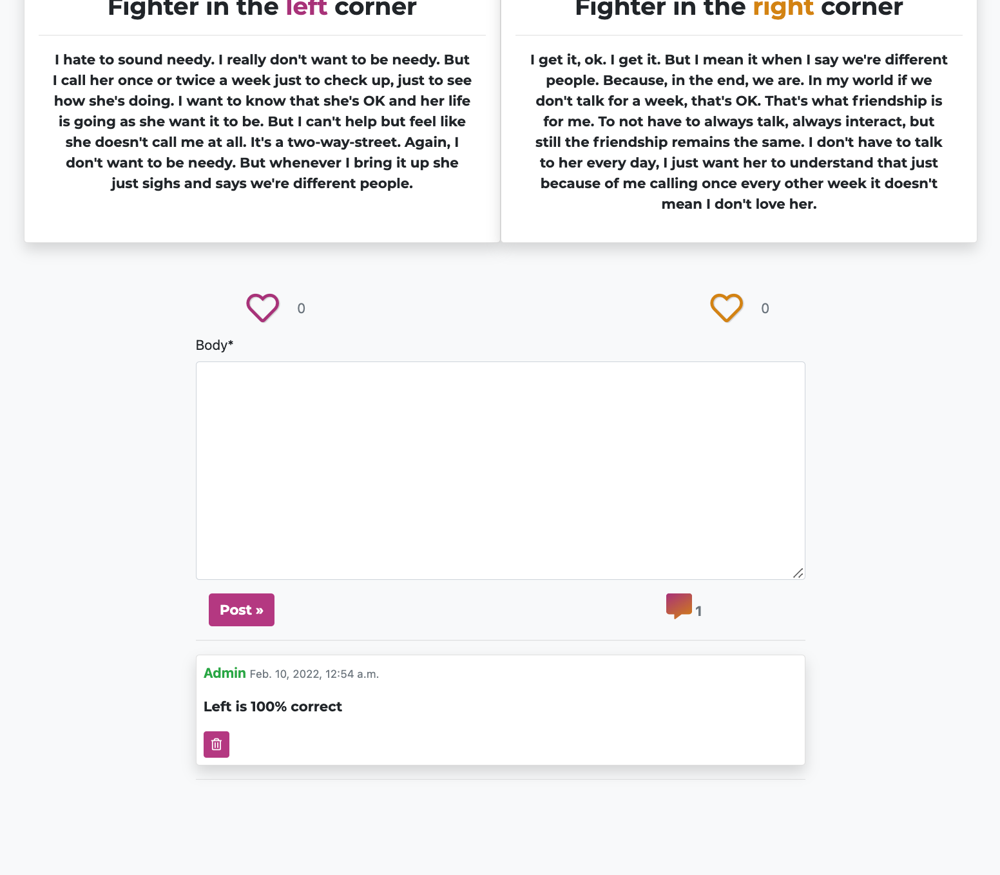

- 4 As a Site user / Admin I can view the number of likes on each post so that I can see which argument is winning, 10. As a User I can like which of the two posts i agree with so that I can be a part of deciding the winner of the argument

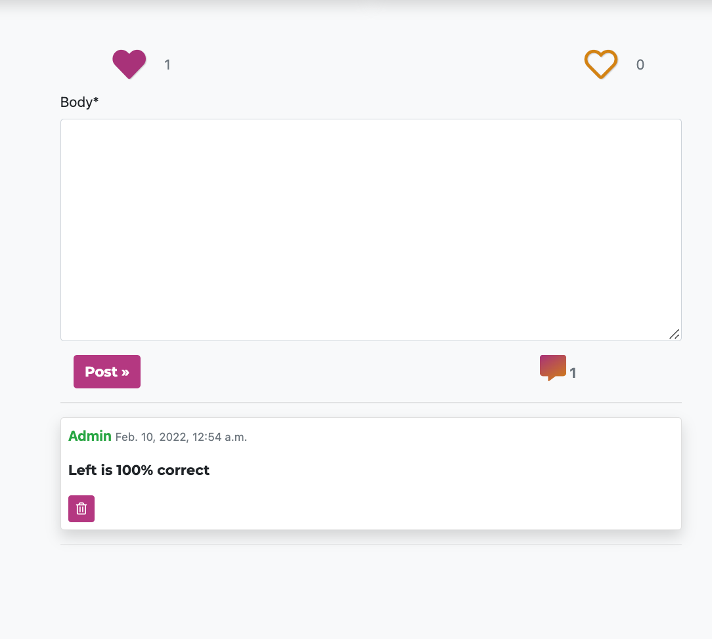

- 5 As a Site User I can create an account so that I can comment, like, and post

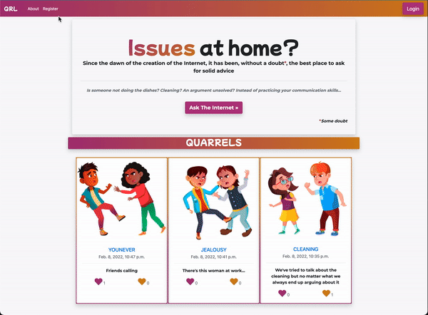

- 6 As a Site User I can create a post so that I can view it on the site and receive comments from other users

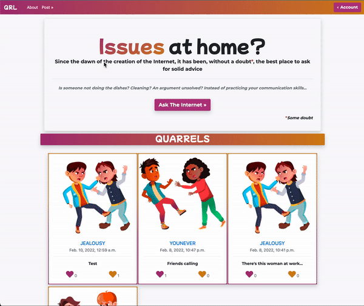

- 7 As a Site user I can leave comments on a post so that I can be a part of the conversation

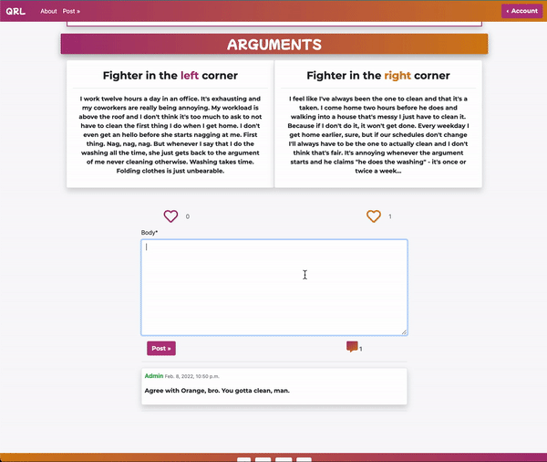

-8. As a Site User I can create, read, update and delete posts so that I can manage my posts content, 15. As a User I can delete my comment so that I can write a new one, or if I regret it, 11. As a User I can update my post so that I can edit a post if something went wrong

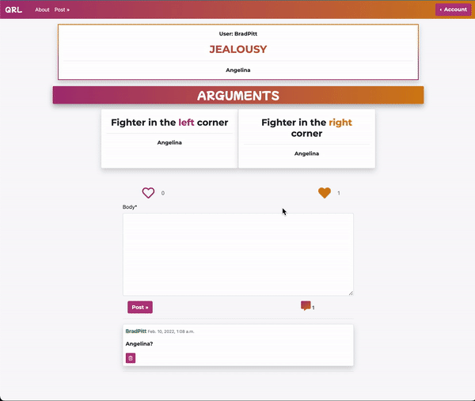

- 9 As a Site user I can go to next page so that I see more posts

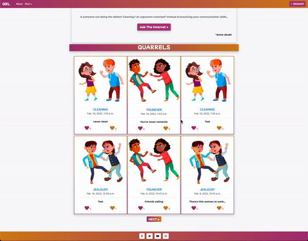

- 13. As a user I can delete my account so that I don't have an account anymore

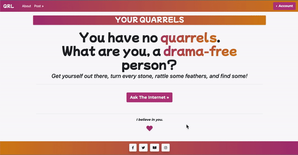

- 12. As a user I can delete my post so that I, or anyone else, can see it anymore

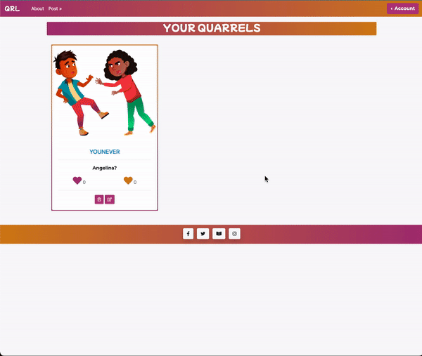

Url stress test:

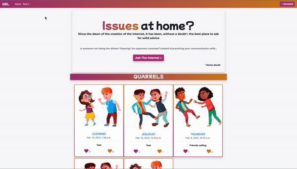
